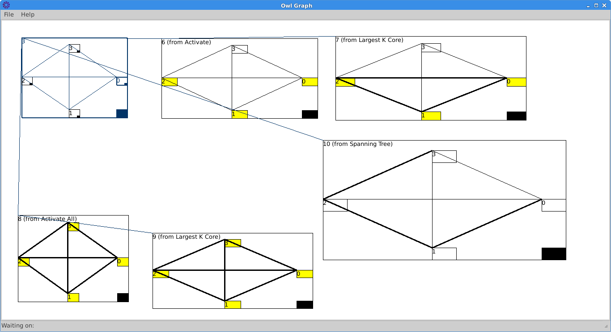

Owlgraph
====================

Owlgraph is a program for visualizing real-time arithmetic operations on
graphs. The user can create graphs, find their properties (i.e. minimal
spanning tree or shortest path) and see how those properties change as the
graph is manipulated (i.e. adding or subtracting nodes and edges). The user can
look at as many properties at once as they like. Graphlab also allows
properties to be composed (i.e. find the minimal spanning tree of the largest
k-core in a graph.) All of this is packaged into a powerful, intuitive
interface.

Installation
=======================

Using Owl Graph in Windows:

Owl Graph is a collection of Python scripts employing numpy and pygtk. As such, running Owl Graph requires the following:

1. Python x, where 2.6 <= x < 3 (Get the windows binary for the latest 2.x.x release: http://www.python.org/download/)
2. A Gtk+ runtime environment (http://sourceforge.net/projects/gtk-win/)
   - When given the choice during installation, make sure to choose "<instdir>", not "<instdir>\bin" or <instdir\lib>
3. Pygtk, which actually requires three things 
   - pygtk itself (http://ftp.gnome.org/pub/GNOME/binaries/win32/pygtk/2.16/)
   - pycairo (http://ftp.gnome.org/pub/GNOME/binaries/win32/pycairo/1.8/)
   - pygobject (http://ftp.gnome.org/pub/GNOME/binaries/win32/pygobject/2.20/)
4. Numpy (win32 superpack: http://sourceforge.net/projects/numpy/files/)
5. Once everything is installed, run graphlab.py with python. (In windows this usually means double clicking on owlgraph.py.)

Using Owl Graph in Linux:

1. Make sure you have python x where 2.6 <= x < 3, as well as pygtk and numpy
   - In stock Ubuntu Lucid, you already have everything but numpy
   - so just run: 
		sudo apt-get install python-numpy
		and you should be good
   - In Ubuntu Precise, you also need python-glade2 ( run sudo apt-get install python-glade2)
2. chmod a+x graphlab.py
3. ./owlgraph.py

Using Owl Graph in OSX:

I hear this is even more of a nightmare than Windows. Good luck. 

Usage
==============

See doc/help/index.html for usage instructions
